<div id="top"></div>


<!-- PROJECT LOGO -->
<br />
<div align="center">
    
  <h2 align="center">TP 1</h2>
  <h3 align="center">Attaques passives : sniffing passif</h3>
</div>


<!-- TABLE OF CONTENTS -->

  <summary>Table of Contents</summary>
  <ol>
   <li><a href="#Objectifs-de-ce-TP">Objectifs de ce TP</a></li>
   <li><a href="#Outils-logiciels">Outils logiciels</a></li>
   <li><a href="#Informations-utiles">Informations utiles</a></li>
    <li>
      <a href="#Part-I">Partie 1 : Implémentation d’un sniffer passif</a>
         <ul>
              <li><a href="#Compilation-et-la-génération">Compilation et la génération du code source (sniffer_eth_ip_tcp_data.c)</a></li>
              <li><a href="#exécution-du-sniffer">L'exécution du sniffer (./sniffer eth0 100)</a></li>
              <li><a href="#affichage-du-contenu-de-l’entête-ETHERNET">L'affichage du contenu de l’entête ETHERNET</a></li>
              <li><a href="#Afficher-du-contenu-des-entêtes-des-protocoles">L'Afficher du contenu des entêtes des protocoles des niveaux supérieurs</a></li>
              <li><a href="#La-fonction-qui-permet-d’afficher-l’entête-UDP">La fonction qui permet d’afficher l’entête UDP</a></li>
           </ul>
        </li>
        <li><a href="#Part-II">Partie2 : manipulation de sniffers</a>
            <ul> 
              <li><a href="#Lancement-du-logiciel-wireshark-et-Observation-des-paquets-capturés">Lancement du logiciel wireshark et Observation des paquets capturés</a></li>
              <li><a href="#capturation-des-trafics-échangés-entre-les-machines-du-reste-du-réseau">Est-ce que vous pouvez capturer les trafics échangés entre les machines du reste du réseau?</a></li>
              <li><a href="#Configuration-du-filtre-de-wireshark">Configuration du filtre de wireshark</a></li>
                <ul>
                   <li><a href="#affichage-du-trames-concernant-les-protocoles">L'affichage du trames concernant le protocole: bootp, tcp, icmp,etc</a></li>
                   <li><a href="#affichage-du-trames-dont-l'adresse-MAC-destination-est-celle-de-votre-machine">L'affichage du trames dont l'adresse MAC destination est celle de votre machine</a></li>
                   <li><a href="#affichage-du-trames-échangé-entre-deux-machines">L'affichage du trames échangé entre deux machines d'adresse @IP1 et @IP2</a></li>
                   <li><a href="#affichage-du-trames-dont-la-taille-est-supérieure-à-une-taille-donnée">L'affichage du trames dont la taille est supérieure à une taille donnée</a></li>
                </ul>
            </ul>
           </li> 
        <li><a href="#Part-III">Partie3 : remote sniffing</a>
            <ul> 
              <li><a href="#La-capturation-du-trafic-entre-la-machine-locale-et-la-machine-distante">La capturation du trafic entre la machine
locale et la machine distante</a></li>
              <li><a href="#Etudier-les-paquets-capturés">L'Etude des paquets capturés</a></li>
            </ul>
        </li>
   </ol>

# Attaques passives : sniffing passif

Les sniffers (appelé aussi « analyseurs de protocoles » ou « analyseurs de réseau ») sont des
outils logiciels qui peuvent capturer les trames circulant sur un réseau local et afficher leurs
contenus (entêtes des protocoles, identités des utilisateurs, mot de passe non cryptés, etc). Ces
outils sont utilisés par les administrateurs pour analyser leurs réseaux et localiser les
problèmes dans ces derniers. Ils sont aussi utilisés par les attaquants pour espionner les
données circulant dans un réseau local.

<div align="center">
    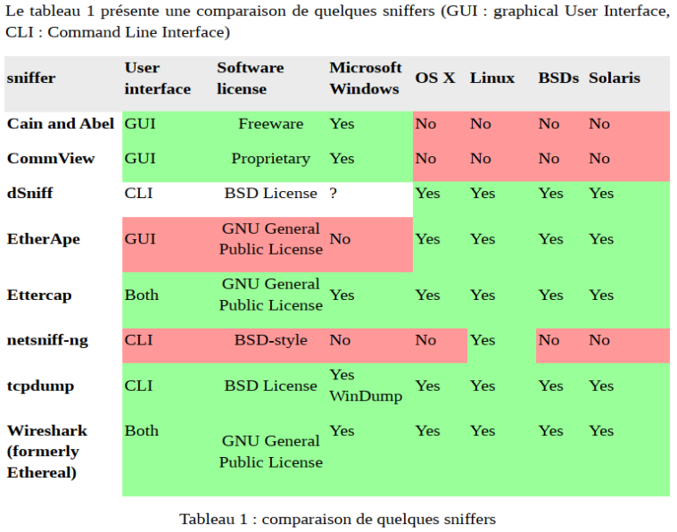
</div>

# Objectifs-de-ce-TP
> - Implémenter un sniffer passif simple
> - Manipuler des logiciels de sniffing

# Outils-logiciels
> - Linux 
> - wireshark 
> - compilateur cc ou gcc

# Informations-utiles

> - Les cartes réseau fonctionnent en deux modes
>  * mode normal (mode par défaut) : permet à une carte de filtrer les trames reçus en fonction de l'adresse MAC destination
>  * mode promiscuous : consiste à accepter toutes les trames circulant dans un réseau, même ceux qui ne sont pas destinés à la carte.
> - Sous Unix, la commande # ifconfig promisc permet d’activer le mode promiscuous.
> - La plupart des logiciels sniffers permettent d’activer le mode promoscuous lors de leur lancement.
> - Dans un réseau commuté, le sniffing passif de toutes les trames qui circulent dans le réseau est impossible à réaliser puisqu'un nœud ne peut recevoir que les trames qui lui sont destinées.
> - Le sniffing actif (qui sera traité au niveau du TP2) permet de faire du sniffing sur un réseau même s'il est commuté.
> - Le sniffer doit être sur le même réseau à sniffer. Sinon, il doit faire du « remote sniffing » en contrôlant à distance une machine qui se trouve sur le réseau à sniffer.

# Part-I
# Implémentation d’un sniffer passif
>  L'annexe 1 présente le code source d’un sniffer passif qui permet de récupérer les trames reçues par
> une interface réseau (exemple ETHERNET). Ce code source est écrit en langage C et peut être
> compilé et exécuté sur une machine Linux. Les fonctions les plus importantes de ce code sont (voir
> contenu de lafonction main):
>  - La fonction recvfrom qui permet de récupérer les trames reçues sur l’interface réseau.
>  - La fonction PrintPacketInHex qui permet d’afficher la trame sous format hexadécimal
>  - La fonction ParseEthernetHeader qui permet d’afficher quelques champs de l’entête ETHRNET
>  - La fonction ParseIpHeader qui permet d’afficher quelques champs de l’entête IP
>  - La fonction ParseTcpHeader qui permet d’afficher quelques champs de l’entête TCP
>  - La fonction ParseData qui permet d’afficher les données sous format hexadécimal


## Compilation-et-la-génération

<div align="center">
    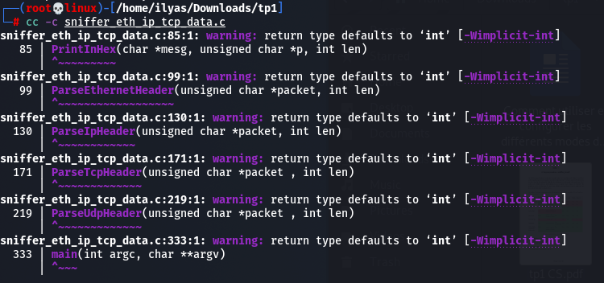
</div>

> La Compilation du (cc -c sniffer_eth_ip_tcp_data.c).

<div align="center">
    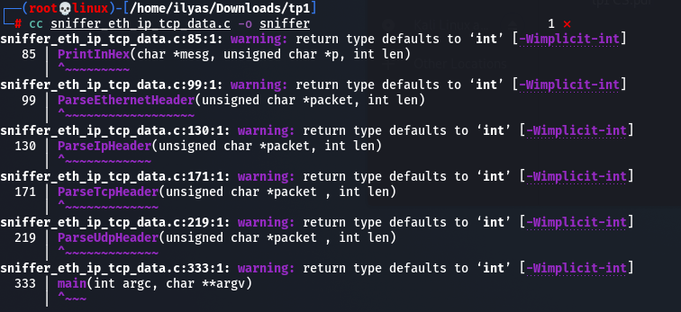
</div>

> La génération du (cc sniffer_eth_ip_tcp_data.c -o sniffer).

<p align="right">(<a href="#top">back to top</a>)</p>


## exécution-du-sniffer

On execute le sniffer pour sniffer les 100 premieres trames reçues
sur l’interface eth0.

<div align="center">
    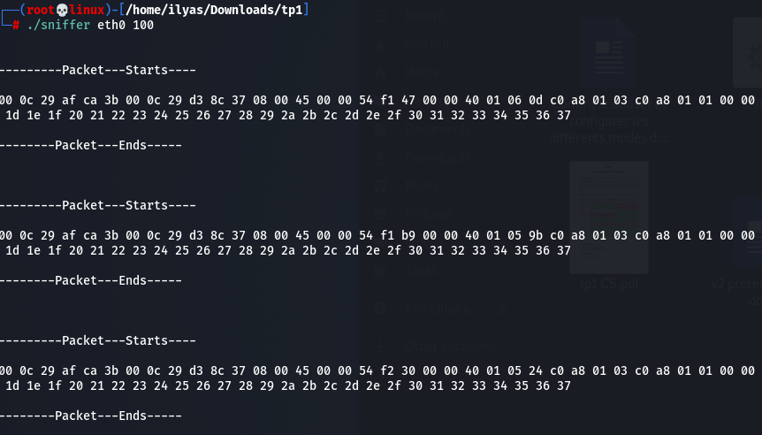
</div>

> Dans ce cas les trames sont affichées sous format hexadécimal.

<p align="right">(<a href="#top">back to top</a>)</p>


## affichage-du-contenu-de-l’entête-ETHERNET
Pour afficher le contenu de l’entête ETHERNET, il faut enlever le
commentaire de la fonction ParseEthernetHeader. Aprés la
compilation et l’execution nous obtenons le résultat suivant:

<div align="center">
    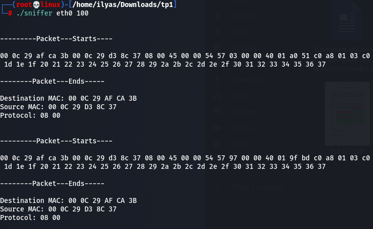
</div>

<p align="right">(<a href="#top">back to top</a>)</p>


## Afficher-du-contenu-des-entêtes-des-protocoles

Pour Afficher le contenu des entêtes des protocoles des niveaux
supérieurs, enlevez les commentaires des fonctions
correspondantes (au niveau de la fonction main), on régénère
l’executable et on l’execute:

<div align="center">
    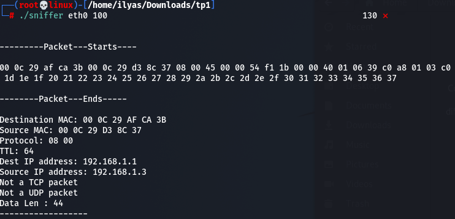
</div>

<p align="right">(<a href="#top">back to top</a>)</p>


## La-fonction-qui-permet-d’afficher-l’entête-UDP

La fonction qui affiche l’en-tête UDP :
```C
ParseUdpHeader(unsigned char *packet , int len)
{
       struct ethhdr *ethernet_header;
       struct iphdr *ip_header;
       struct udphdr *udp_header;
       /* Check if enough bytes are there for TCP Header */
       if(len >= (sizeof(struct ethhdr) + sizeof(struct iphdr) + sizeof(struct
udphdr)))
      {
              /* Do all the checks: 1. Is it an IP pkt ? 2. is it TCP ? */
              ethernet_header = (struct ethhdr *)packet;
              if(ntohs(ethernet_header->h_proto) == ETH_P_IP)
              {
                    ip_header = (struct iphdr *)(packet + sizeof(struct ethhdr));
                    if(ip_header->protocol == IPPROTO_UDP)
                    {
                          printf("UDP datagram (UDP num=%d)\n", ip_header->protocol);
                          udp_header = (struct udphdr*)(packet + sizeof(struct
ethhdr) + ip_header->ihl*4 );
                        /* Print the Dest and Src ports */
                        printf("Source Port: %d\n", ntohs(udp_header->source));
                        printf("Dest Port: %d\n", ntohs(udp_header->dest));
                    }
                    else
                    {
                        printf("Not a UDP packet\n");
                    }
             }
             else
             {
                     printf("Not an IP packet\n");
             }
        }
        else
        {
              printf("UDP Header not present \n");
        }
}
```

<p align="right">(<a href="#top">back to top</a>)</p>


# Part-II
Dans cette partie, nous nous intéressons à la manipulation de quelques sniffers existants.
(Pour plus d’informations sur l’utilisation de wireshark ([cliquez ici](https://blog.varonis.fr/comment-utiliser-wireshark/)) et ([ici](http://www.machaon.fr/isn/reseaux/Fiche-Wireshark.pdf))

## Lancement-du-logiciel-wireshark-et-Observation-des-paquets-capturés

On lance le logiciel Wireshark et on démarre la capture sur
l’interface eth0:

<div align="center">
    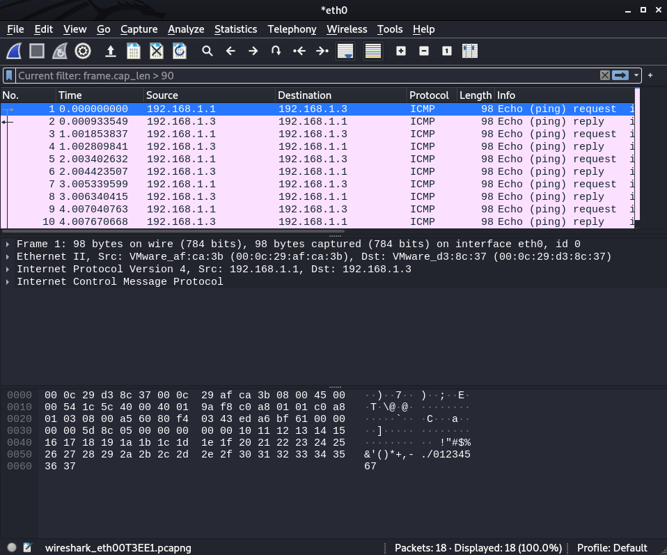
</div>

<p align="right">(<a href="#top">back to top</a>)</p>

## capturation-des-trafics-échangés-entre-les-machines-du-reste-du-réseau

**Est-ce que vous pouvez capturer les trafics échangés entre les machines du reste du réseau?**

Nous n’avons pas pu échanger de trafic entre d'autres machines et le reste du réseau. Car on est pas on mode promiscieux.

<p align="right">(<a href="#top">back to top</a>)</p>

## Configuration-du-filtre-de-wireshark
## affichage-du-trames-concernant-les-protocoles
**L'affichage du trames concernant le protocole: bootp, tcp, icmp,etc**
<div align="center">
    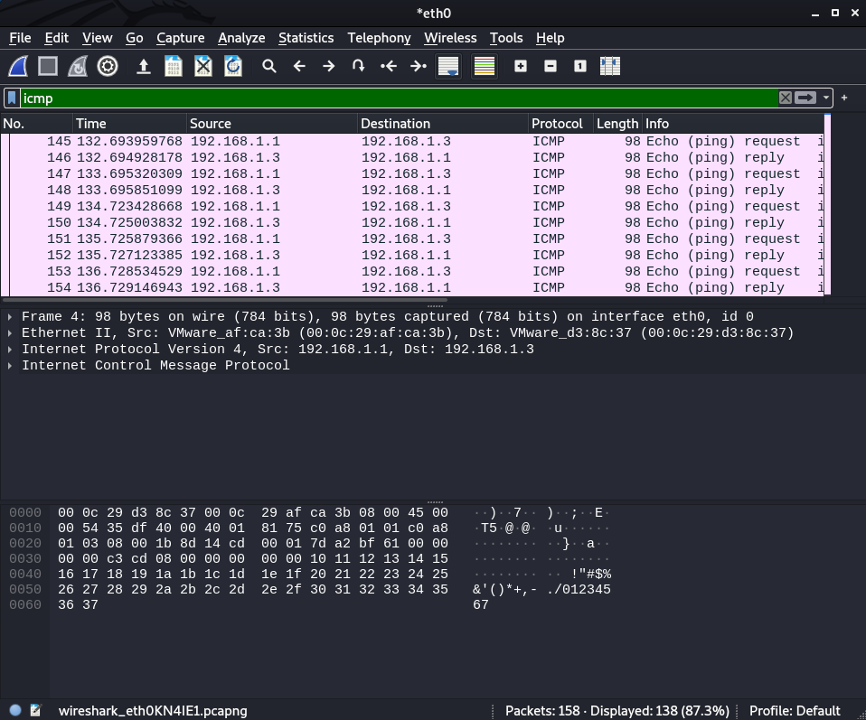
</div>


<p align="right">(<a href="#top">back to top</a>)</p>

## affichage-du-trames-dont-l'adresse-MAC-destination-est-celle-de-votre-machine

**L'affichage du trames dont l'adresse MAC destination est celle de votre machine**
<div align="center">
    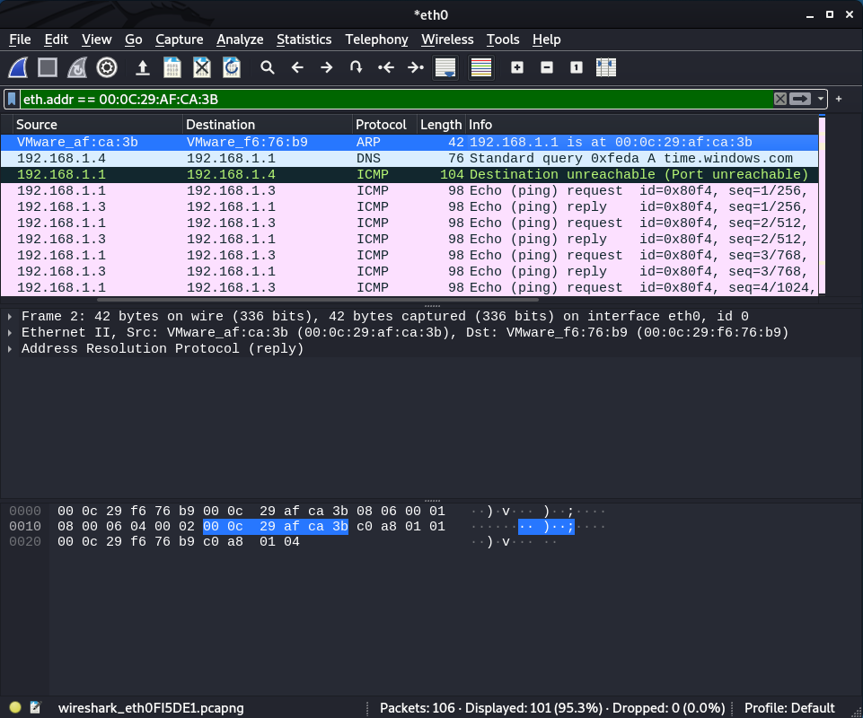
</div>

<p align="right">(<a href="#top">back to top</a>)</p>

## affichage-du-trames-échangé-entre-deux-machines
**L'affichage du trames échangé entre deux machines d'adresse @IP1 et @IP2**
<div align="center">
    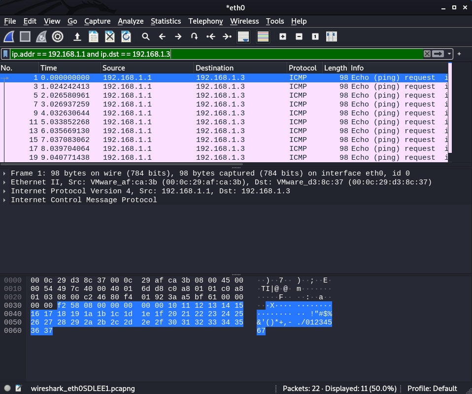
</div>

<p align="right">(<a href="#top">back to top</a>)</p>

## affichage-du-trames-dont-la-taille-est-supérieure-à-une-taille-donnée
**L'affichage du trames dont la taille est supérieure à une taille donnée**
<div align="center">
    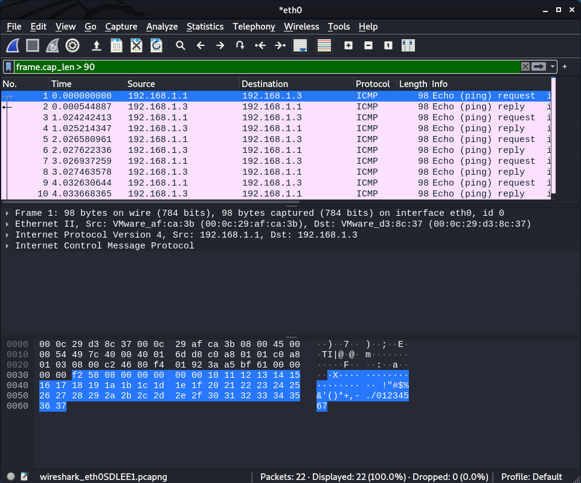
</div>

<p align="right">(<a href="#top">back to top</a>)</p>

# Part-III

Dans cette section, nous nous intéressons l'utilisation d'un sniffer à distance « remote sniffing » pour obtenir les données circulant sur un autre réseau que celui sur lequel nous sommes. Supposons que nous sommes sur le réseau RES1 et nous voulons sniffer le réseau voisin RES2 (nous sommes séparés par un routeur). Nous utilisons alors un **client sniffer** sur une machine du réseau RES2 qui va sniffer ce dernier et envoyer les données capturées à notre **serveur sniffer** sur le réseau RES1. Le réseau B qui, en principe, était impossible à sniffer est devenu donc très accessible. Nous utilisons le démon **Rpcapd** ([plus de détails](https://www.winpcap.org/docs/docs_412/html/group__remote.html)) qui capture le trafic sur une machine, et est capable d'envoyer les données récupérées à un sniffer comme wireshark qui facilite ainsi la lecture en différenciant les trames et les protocoles. Notons qu'il est utile d'exclure le trafic entre la machine locale et la machine distante en utilisant les filtres de wireshark.

## La-capturation-du-trafic-entre-la-machine-locale-et-la-machine-distante

<p align="right">(<a href="#top">back to top</a>)</p>

## Etudier-les-paquets-capturés


<p align="right">(<a href="#top">back to top</a>)</p>


Out Team - [AIT EL KADI Ilyas](https://github.com/IlyasKadi) - [AZIZ Oussama](https://github.com/ATAMAN0) - [BENCHEDI Yahia](https://github.com/Ben776ya)

Project Link: [https://github.com/IlyasKadi/Attaques_passives--sniffing_passif](https://github.com/IlyasKadi/Attaques_passives--sniffing_passif)

<p align="right">(<a href="#top">back to top</a>)</p>
