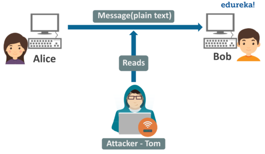

<div id="top"></div>


<!-- PROJECT LOGO -->
<br />
<div align="center">
    
  <h2 align="center">Project 2</h2>
  <h3 align="center">Domain Name System Protocol</h3>
</div>


<!-- TABLE OF CONTENTS -->

  <summary>Table of Contents</summary>
  <ol>
   <li><a href="#Objectifs-de-ce-TP">Objectifs de ce TP</a></li>
   <li><a href="#Outils-logiciels">Outils logiciels</a></li>
   <li><a href="#Informations-utiles">Informations utiles</a></li>
    <li>
      <a href="#Part-I">Partie 1 : Implémentation d’un sniffer passif</a>
         <ul>
              <li><a href="#DNS-role-functions">Compilation et la génération du code source (sniffer_eth_ip_tcp_data.c)</a></li>
              <li><a href="#different-DNS-servers">L'exécution du sniffer (./sniffer eth0 100)</a></li>
              <li><a href="#DNS-configuration-steps">L'affichage du contenu de l’entête ETHERNET</a></li>
              <li><a href="#Configure-the-named">L'Afficher du contenu des entêtes des protocoles des niveaux supérieurs</a></li>
              <li><a href="#Configure-the-named">La fonction qui permet d’afficher l’entête UDP</a></li>
           </ul>
        </li>
        <li><a href="#Part-II">Partie2 : manipulation de sniffers</a>
            <ul> 
              <li><a href="#different-DNS-servers">Lancement du logiciel wireshark</a></li>
              <li><a href="#DNS-configuration-steps">Observation des paquets capturés (L’échange du trafic entre d'autres machines et la votre)</a></li>
              <li><a href="#Configure-the-named">Est-ce que vous pouvez capturer les trafics échangés entre les machines du reste du réseau?</a></li>
              <li><a href="#Configure-the-named">Configuration du filtre de wireshark</a></li>
                <ul>
                   <li><a href="#DNS-role-functions">L'afficher du trames concernant le protocole: bootp, tcp, icmp,etc</a></li>
                   <li><a href="#different-DNS-servers">L'afficher du trames dont l'adresse MAC destination est celle de votre machine</a></li>
                   <li><a href="#DNS-configuration-steps">L'afficher du trames échangé entre deux machines d'adresse @IP1 et @IP2</a></li>
                   <li><a href="#Configure-the-named">L'afficher du trames  dont la taille est supérieure à une taille donnée</a></li>
                </ul>
            </ul>
           </li> 
        <li><a href="#Part-III">Partie3 : remote sniffing</a>
            <ul> 
              <li><a href="#different-DNS-servers">La capturation du trafic entre la machine
locale et la machine distante</a></li>
              <li><a href="#DNS-configuration-steps">Etudier les paquets capturés</a></li>
            </ul>
        </li>
   </ol>


# Objectifs-de-ce-TP

- Implémenter un sniffer passif simple
- Manipuler des logiciels de sniffing

# Outils-logiciels
- Linux 
- wireshark 
- compilateur cc ou gcc

# Informations-utiles
- Les cartes réseau fonctionnent en deux modes
   * mode normal (mode par défaut) : permet à une carte de filtrer les trames reçus en
fonction de l'adresse MAC destination
   * mode promiscuous : consiste à accepter toutes les trames circulant dans un réseau,
même ceux qui ne sont pas destinés à la carte.

- Sous Unix, la commande # ifconfig promisc permet d’activer le mode promiscuous.

- La plupart des logiciels sniffers permettent d’activer le mode promoscuous lors de leur
lancement.

- Dans un réseau commuté, le sniffing passif de toutes les trames qui circulent dans le réseau est
impossible à réaliser puisqu'un nœud ne peut recevoir que les trames qui lui sont destinées.

- Le sniffing actif (qui sera traité au niveau du TP2) permet de faire du sniffing sur un réseau
même s'il est commuté.

- Le sniffer doit être sur le même réseau à sniffer. Sinon, il doit faire du « remote sniffing » en
contrôlant à distance une machine qui se trouve sur le réseau à sniffer.

# Part-I
# Implémentation d’un sniffer passif
L'annexe 1 présente le code source d’un sniffer passif qui permet de récupérer les trames reçues par
une interface réseau (exemple ETHERNET). Ce code source est écrit en langage C et peut être
compilé et exécuté sur une machine Linux. Les fonctions les plus importantes de ce code sont (voir
contenu de lafonction main):

  - La fonction recvfrom qui permet de récupérer les trames reçues sur l’interface réseau.
  - La fonction PrintPacketInHex qui permet d’afficher la trame sous format hexadécimal
  - La fonction ParseEthernetHeader qui permet d’afficher quelques champs de l’entête ETHRNET
  - La fonction ParseIpHeader qui permet d’afficher quelques champs de l’entête IP
  - La fonction ParseTcpHeader qui permet d’afficher quelques champs de l’entête TCP
  - La fonction ParseData qui permet d’afficher les données sous format hexadécimal

## DNS-role-functions

 ### **What is DNS?**

> The Domain Name System (DNS) is the phonebook of the Internet. Humans access information online through domain names, like nytimes.com or espn.com. Web browsers interact > through Internet Protocol (IP) addresses. DNS translates domain names to IP addresses so browsers can load Internet resources.

> Each device connected to the Internet has a unique IP address which other machines use to find the device. DNS servers eliminate the need for humans to memorize IP addresses > such as 192.168.1.1 (in IPv4), or more complex newer alphanumeric IP addresses such as 2400:cb00:2048:1::c629:d7a2 (in IPv6).


### **How does DNS work?**


> The process of DNS resolution involves converting a hostname (such as www.example.com) into a computer-friendly IP address (such as 192.168.1.1). An IP address is given to > each device on the Internet, and that address is necessary to find the appropriate Internet device - like a street address is used to find a particular home. When a user wants > to load a webpage, a translation must occur between what a user types into their web browser (example.com) and the machine-friendly address necessary to locate the example.com > webpage.

> In order to understand the process behind the DNS resolution, it’s important to learn about the different hardware components a DNS query must pass between. For the web > browser, the DNS lookup occurs "behind the scenes" and requires no interaction from the user’s computer apart from the initial request.


### **There are 4 DNS servers involved in loading a webpage:**


>   - **DNS recursor** - The recursor can be thought of as a librarian who is asked to go find a particular book somewhere in a library. The DNS recursor is a server designed to > receive queries from client machines through applications such as web browsers. Typically the recursor is then responsible for making additional requests in order to satisfy > the client’s DNS query.
   
>   - **Root nameserver** - The root server is the first step in translating (resolving) human readable host names into IP addresses. It can be thought of like an index in a > library that points to different racks of books - typically it serves as a reference to other more specific locations.
   
>   - **TLD nameserver** - The top level domain server (TLD) can be thought of as a specific rack of books in a library. This nameserver is the next step in the search for a > specific IP address, and it hosts the last portion of a hostname (In example.com, the TLD server is “com”).
   
>   - **Authoritative nameserver** - This final nameserver can be thought of as a dictionary on a rack of books, in which a specific name can be translated into its definition. > The authoritative nameserver is the last stop in the nameserver query. If the authoritative name server has access to the requested record, it will return the IP address for > the requested hostname back to the DNS Recursor (the librarian) that made the initial request.


<p align="right">(<a href="#top">back to top</a>)</p>

<!-- different DNS servers -->
## different-DNS-servers


### **The 8 steps in a DNS lookup:**

 ```Diff
 - 1.- A user types ‘example.com’ into a web browser and the query travels into the Internet and is received by a DNS recursive resolver.
 
 - 2.- The resolver then queries a DNS root nameserver (.).
 
 - 3.- The root server then responds to the resolver with the address of a Top Level Domain (TLD) DNS server (such as .com or .net), which stores the information for its domains. When searching for example.com, our request is pointed toward the .com TLD.
 
 - 4.- The resolver then makes a request to the .com TLD.
 
 - 5.- The TLD server then responds with the IP address of the domain’s nameserver, example.com.
 
 - 6.- Lastly, the recursive resolver sends a query to the domain’s nameserver.
 
 - 7.- The IP address for example.com is then returned to the resolver from the nameserver.
 
 - 8.- The DNS resolver then responds to the web browser with the IP address of the domain requested initially.
 
Once the 8 steps of the DNS lookup have returned the IP address for example.com, the browser is able to make the request for the web page:

 + 9.+ The browser makes a HTTP request to the IP address.
 
 + 10.+ The server at that IP returns the webpage to be rendered in the browser (step 10).
 ```

<p align="right">(<a href="#top">back to top</a>)</p>

<!-- DNS configuration steps -->
## DNS-configuration-steps

### Configure-the-named

<div align="center">
    
</div>


### configure-zone-files

 <div align="center">
    
 </div>


<div align="center">
    
</div>


### Verify-the-configuration


<p align="right">(<a href="#top">back to top</a>)</p>

<!-- Configure the DNS Client -->
## Configure-the-DNS-Client

<div align="center">
    
</div>

<div align="center">
    
</div>

<p align="right">(<a href="#top">back to top</a>)</p>


<!-- Configure primary and secondary DNS servers -->
## Configure-primary-and-secondary-DNS-servers
### primary-DNS-server

<div align="center">
    
</div>

<div align="center">
    
</div>

### secondary-DNS-server
<div align="center">
    
</div>
<div align="center">
    
</div>

### Test-the-configuration
<div align="center">
    
</div>

<p align="right">(<a href="#top">back to top</a>)</p>

# Part-II
## Configure-the-DDNS-server

<p align="right">(<a href="#top">back to top</a>)</p>

### Install-the-necessary-packages


### Configure-the-forward-and-reverse-zones


<p align="right">(<a href="#top">back to top</a>)</p>


<!-- Configure the client -->
## Configure-the-client


<p align="right">(<a href="#top">back to top</a>)</p>


<!-- Verify the configuration -->
## Verify-the-configuration


<p align="right">(<a href="#top">back to top</a>)</p>

# Part-III
 **Project description:**
  - The goal is to set up a DNS server on a demilitarized zone, based on the delegation  between  two  DNS  servers  (parent  server  and  child  server).The network diagram is as follows:
  
<p align="center">
     
   </p>

<p align="right">(<a href="#top">back to top</a>)</p>

Out Team - [AIT EL KADI Ilyas](https://github.com/IlyasKadi) - [AZIZ Oussama](https://github.com/ATAMAN0)

Project Link: [https://github.com/IlyasKadi/Domain-Name-System-Protocol](https://github.com/IlyasKadi/Domain-Name-System-Protocol)

<p align="right">(<a href="#top">back to top</a>)</p>
